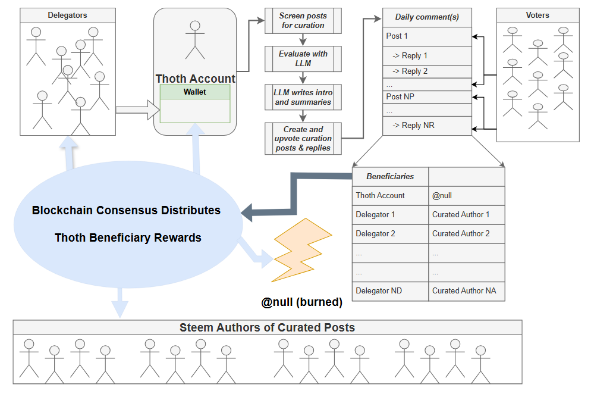

# Thoth

## Project Diagram


## Overview

Thoth is a curation bot that runs on the Steem blockchain.  It filters posts based upon the Thoth operator's preferences, and then does an evaluation through an LLM API call.  If the LLM decides to curate the post, it will write a summary and include links to the source article.  When all articles have been selected, it also creates a summary/overview post.  These are then posted to the Steem blockchain, as follows:

- Introductory/overview post  
---> Reply 1 # Summary of curated post 1  
---> Reply 2 # Summary of curated post 2  
---> ...  
---> Reply N #  # Summary of curated post N  

Each post and reply provides the ability to direct beneficiary rewards to the following recipient roles:
- Included authors
- Delegators to the Thoth account
- The Thoth account, itself
- @null for reward-burning

After posting is done, the post and replies receive upvotes from the Thoth account and the blockchain consensus will eventually distribute all rewards as specified in the beneficiary settings.

---

## Thoth’s Flywheel (Incentive Model)

Thoth operates as a self-reinforcing  cycle: curated authors, delegators, and the operator are aligned through beneficiary rewards and blockchain incentives.

<p align="center">
  
</p>

This flywheel illustrates how content creation, curation, posting, and reward distribution reinforce one another over time.
## Installation

1. **Set-up a python-steem virtual environment**

For example, here's how to do it in Windows.  

- [Getting steem-python to run on Windows with the latest python version](https://steemit.com/steem-dev/@remlaps/getting-steem-python-to-run)

2.  **Clone the repository:**

    ```bash
    git clone https://github.com/remlaps/Thoth.git
    cd Thoth
    ```

3.  **Install dependencies:**

    Install the required Python packages using the `requirements.txt` file:

    ```bash
    pip install -r requirements.txt
    ```

## Configuration

Thoth can be configured by editing `config/config.ini` and by using environment variables.

> **Note on Configuration:** This project is under active development. It is crucial to review all settings in `config/config.ini`, especially those related to post screening and beneficiary rewards. Not all planned screening features are functional at this time.

### 1. API Key (Required)

The LLM API key is required. It is recommended to provide it via an environment variable for better security, but it can also be set in the config file.

*   **(Recommended) Environment Variable:** Set an environment variable named `LLMAPIKEY`. The script will prioritize this method.
*   **(Alternative) Config File:** If the `LLMAPIKEY` environment variable is not found, the script will use the `ARLIAI_KEY` value from `config/config.ini`.

### 2. Config.ini

Customize the `config/config.ini` file to your preferences.

| Section | Key                             | Description                                                                                             |
|---------|---------------------------------|---------------------------------------------------------------------------------------------------------|
| `ARLIAI`  | `ARLIAI_KEY`                    | Your LLM API Key (used as a fallback if `LLMAPIKEY` env var is not set).                                  |
| `ARLIAI`  | `ARLIAI_MODEL`                  | The specific model(s) for the LLM API. Use a single model (e.g., `gemini-2.5-pro`) or comma-separated list for fallback (e.g., `gemini-2.5-pro,gemini-2.5-flash`). If the primary model is rate-limited, the system automatically switches to the next available model.                                                 |
| `ARLIAI`  | `ARLIAI_URL`                    | The base URL for the LLM API endpoint (tested with Google Gemini and ArliAI endpoints).                   |
| `ARLIAI`  | `ARLIAI_ENABLE_MODEL_SWITCHING` | Enable automatic model switching when the current model is rate-limited (HTTP 429 or 503 overloaded). Default: `False`. Set to `True` to enable fallback to the next model in the `ARLIAI_MODEL` list. Requires a comma-separated model list to be effective.                   |
| `ARLIAI`  | `ARLIAI_MODEL_SWITCHING_DRY_RUN` | When enabled (`True`) along with `ARLIAI_ENABLE_MODEL_SWITCHING`, logs rate-limit events and marks models as rate-limited, but does **not** actually switch to the next model. Useful for observation and testing before enabling live switching. Default: `False`.                   |
| `STEEM`   | `STEEM_API`                     | The Steem node to connect to (e.g., `https://api.steemit.com`). Leave blank for default.                  |
| `STEEM`   | `STREAM_TYPE`                   | `ACTIVE` (recent posts), `HISTORY` (from last run), or `RANDOM`.                          |
| `STEEM`   | `DEFAULT_START_BLOCK`         | The block number to start from if no history is found.                                                  |
| `BLOG`    | `NUMBER_OF_REVIEWED_POSTS`      | The number of posts to find and review before generating the curation summary (max 5).                            |
| `BLOG`    | `NUMBER_OF_DELEGATORS_PER_POST` | The number of top delegators to include as beneficiaries in each reply post (max 5).                              |
| `BLOG`    | `CURATED_AUTHOR_WEIGHT`         | The beneficiary weight (e.g., 1000 for 10%) for each curated author in the top-level post.                                      |
| `BLOG`    | `DELEGATOR_WEIGHT`              | The beneficiary weight for each included delegator in the top-level post.                                                     |
| `BLOG`    | `POSTING_ACCOUNT_WEIGHT`        | The beneficiary weight for the Thoth account itself.                                                    |

#### Beneficiary Reward Settings

The distribution of post rewards to beneficiaries is highly configurable but must follow Steem blockchain rules. Please review these settings carefully.

*   **Weight Limit:** The sum of all beneficiary weights cannot exceed `10000` (which represents 100.00%). You must ensure your configuration respects this limit. The formula for the main summary post is:
    `(`NUMBER_OF_DELEGATORS_PER_POST` * `DELEGATOR_WEIGHT`) + (`NUMBER_OF_REVIEWED_POSTS` * `CURATED_AUTHOR_WEIGHT`) + `POSTING_ACCOUNT_WEIGHT` <= 10000`
*   **Beneficiary Count Limit:** Steem allows a maximum of 8 beneficiaries per post. The bot logic has a soft limit of 6 beneficiaries (delegators + curated authors) to leave room for other beneficiary types (i.e. @null and the posting account).
*  **Value adjustments:** Author and delegator settings will be adjusted from the specified values for Thoth's reply posts.

#### Model Switching for Rate-Limit Resilience

If you provide a comma-separated list of models in `ARLIAI_MODEL`, Thoth can automatically switch to the next model if the current one becomes rate-limited. This provides built-in resilience against LLM API rate-limiting.

**Configuration Example:**
```ini
[ARLIAI]
ARLIAI_MODEL = gemini-2.5-pro,gemini-2.5-flash,gemini-2.0-flash
ARLIAI_ENABLE_MODEL_SWITCHING = True
ARLIAI_MODEL_SWITCHING_DRY_RUN = False
```

**Recommended Rollout Strategy:**

1. **Initial Deployment (Safe Default)**
   - `ARLIAI_ENABLE_MODEL_SWITCHING = False`
   - `ARLIAI_MODEL_SWITCHING_DRY_RUN = False`
   - Behavior: Falls back to standard retry/backoff if rate-limited; does not switch models.

2. **Observation Phase (Dry-Run Mode)**
   - `ARLIAI_ENABLE_MODEL_SWITCHING = True`
   - `ARLIAI_MODEL_SWITCHING_DRY_RUN = True`
   - Behavior: Logs rate-limit events and records which models *would* be switched to, but continues using the current model. Good for validating model list and observing behavior without production impact.

3. **Live Rollout (Full Switching)**
   - `ARLIAI_ENABLE_MODEL_SWITCHING = True`
   - `ARLIAI_MODEL_SWITCHING_DRY_RUN = False`
   - Behavior: When rate-limited, automatically switches to the next model in the list and retries the request. Provides automatic resilience against rate-limiting.

**Logging and Monitoring:**
When model switching is enabled, watch your logs for:
- `WARNING - Marking model as rate limited: <model-name>`
- `WARNING - Switching to next model: <new-model> (Rate limited models: [...])`
- `ERROR - No more models available. All models rate limited: [...]`

These messages indicate the bot's response to rate-limiting and help validate that fallback models are working as intended.


## Usage

To run the bot, you need to activate your ```steem-python``` virtual environment and set the necessary environment variables.  Here's an exampe bat file for Windows.

### Windows (`run.bat`)

```bat
@echo off
REM Activate the steem-python virtual environment
call C:\path\to\your\virtual_env\Scripts\activate

REM Set environment variables to UNLOCK the Steem wallet and the LLM API key.
REM Using "set" makes these variables temporary (only for this command window).
REM For a permanent key, use 'setx LLMAPIKEY "your_key_here"' in a separate command prompt.
set UNLOCK=your_steem_wallet_password
set LLMAPIKEY=your_llm_api_key

REM Run Thoth from its source directory
cd /d C:\path\to\your\Thoth\
python src\main.py

echo.
echo Thoth has finished.

REM Deactivate the virtual environment to clean up the session
call deactivate

pause
```

## Contributing

Contributions are welcome! If you find a bug or have a feature request, please open an issue on GitHub. If you'd like to contribute code, please fork the repository and submit a pull request.

### Needs
- Check the [Issues](https://github.com/remlaps/Thoth/issues) section
- Improve the appearance and information content for Thoth's posts and replies
- Provide options for Thoth to create posts in languages other than English
- Provide options to use additional LLM models
- Preprocessing before handing off to the LLM
   - Replace screening with scoring where possible/appropriate
   - Add a ML/reinforcement learning layer for post recommendations in order to improve picks over time
   - Screen for uniqueness (plagiarism, syndication, cross-posting, repetitive posting, etc.)
   - Screen for AI authorship
- What are your ideas?

## License

This project is licensed under the MIT License - see the LICENSE file for details.

## Disclaimer

This software is provided as-is, without any warranty. Use at your own risk.
