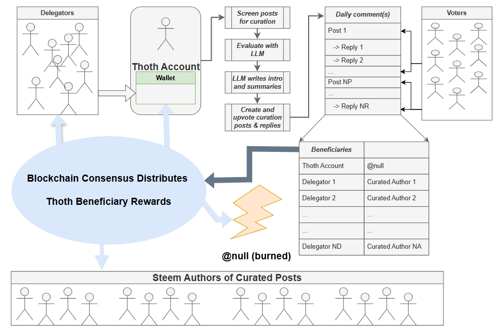
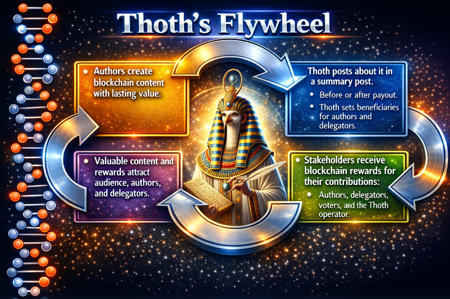

# Thoth

**Version:** 0.1.13-beta

Thoth is an open-source AI curation bot for the [Steem blockchain](https://steem.com).

## What is Thoth?

Thoth is named after the ancient Egyptian god of writing, science, art, wisdom, judgment, and magic. Its mission is to align the incentives of authors and investors toward the production and support of creativity that attracts human eyeballs to the Steem blockchain.

Thoth scans the blockchain for posts — recent and old — screens them against configurable quality rules, and evaluates the strongest candidates with a large language model (LLM). Posts that make the cut are curated: Thoth publishes an overview post with one reply per featured article, links back to the originals, and shares its own post rewards with the accounts who contributed to the effort.

## Why Thoth?

On Steem, most post rewards are concentrated in the first 7 days after publication. Once that window closes, even excellent content stops earning and fades from view. Thoth exists to change that dynamic:

1. **Additional visibility for creators of lasting value.** Great content should not be forgotten just because it has already paid out. Thoth keeps finding and featuring quality posts long after their original payout, giving them additional exposure.  This gives readers a multiple chances to discover the content and it gives curators repeated opportunities to vote for it.

2. **Reward streams that extend beyond the 7-day default.** Featured authors are set as beneficiaries of Thoth's posts and replies, so they continue to earn from content they may have written weeks, months, or even years ago. Every upvote on Thoth's output can follow beneficiary reward settings back to the original authors (#lifetime-rewards).

3. **Passive rewards for delegators.** Users who delegate Steem Power to the Thoth account are included as beneficiaries of the curation posts on a weighted random basis.  Larger delegations are promortionally more likely to be included as beneficiaries. Delegators receive ongoing passive rewards for supporting the curation effort (#passive-rewards).  Thoth sets delegators free of the requirement, imposed by other delegation services, to submit daily posts as a vehicle for receiving rewards.

4. **Less spam.** When rewards are no longer a one-shot, 7-day sprint, the incentive to mass-produce low-effort, plagiarized, or spammy content drops dramatically. When delegators can receive beneficiary rewards without a daily post, the incentive for delegators to create spammy posts on a daily basis is reduced.  By shifting value toward sustained quality, Thoth intends to help the ecosystem reward substance over noise.

5. **Data dignity for creators.** Thoth's reward model reflects a principle Jaron Lanier calls "data dignity".  This is the idea that people should be compensated for the value their contributions create, rather than having that value extracted without acknowledgment. Where Lanier argues that AI systems should give data creators a stake in what they produce, Thoth applies the same idea on-chain: the authors behind curated content keep earning beneficiary rewards and recognition long after their original payout, instead of being mined once and forgotten.

## How Thoth works

1. **Scan** — sample posts from the blockchain via a configurable stream (active, historical, random, or time-weighted-random).
2. **Screen** — apply rule-based filters (word count, tags, language, blacklists, inactivity, delegation health), then a scoring model (author reputation & growth, content quality, engagement).
3. **Evaluate** — a large language model summarizes each qualifying post, highlighting key takeaways and target audiences.
4. **Publish** — each run produces an overview post plus one reply per curated article, each linking back to the original.
5. **Reward** — Thoth upvotes its output, and the blockchain distributes rewards to any or all of the beneficiaries listed below.

Thoth also maintains a tamper-evident, on-chain record of its state and run history as a linked list broadcast via Steem `custom_json` transactions (this can be disabled in the configuration).

### Who earns rewards

| Recipient | How they earn |
|---|---|
| **Curated authors** | A share of the rewards on Thoth's posts and replies for featured content |
| **Delegators** | Passive rewards for Steem Power delegated to the Thoth account |
| **Thoth account / operator** | A share that helps keep the operation running |
| **@null** | Optional reward-burning destination |

## The flywheel (incentive model)

Thoth is designed as a self-reinforcing cycle: content creation feeds curation, curation attracts upvotes and delegations, and beneficiary rewards flow back to the authors and delegators who keep the cycle spinning.

## Getting started

Ready to run your own instance? Follow the **[Installation & Configuration Guide](INSTALLATION.md)** — it covers prerequisites, installation steps, every configuration parameter with suggested starting values, and security best practices.

## Contributing

Contributions are welcome! Please open an [issue](https://github.com/remlaps/Thoth/issues) for bugs or feature ideas and submit pull requests for code changes.

## License

MIT License — see the [LICENSE](LICENSE) file.

## Disclaimer

This software is provided as-is, without warranty of any kind. Use at your own risk. No rate of return is guaranteed or implied.